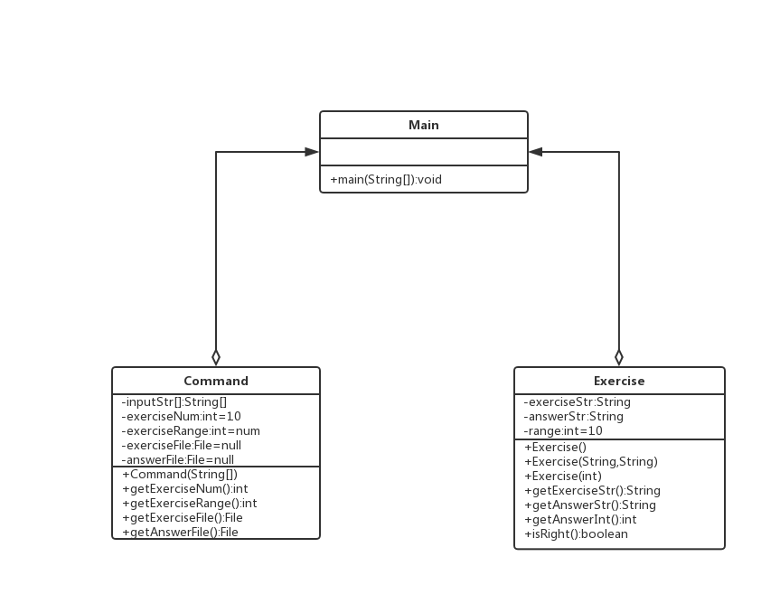

## 一、GitHub地址
[https://github.com/huangzihaohzh/ExerciseMaker](https://github.com/huangzihaohzh/ExerciseMaker)

## 二、估计耗费的时间
<table border=0 cellpadding=0 cellspacing=0 width=965 style='border-collapse:
 collapse;table-layout:fixed;width:724pt'>
 <col width=366 style='mso-width-source:userset;mso-width-alt:11712;width:275pt'>
 <col width=321 style='mso-width-source:userset;mso-width-alt:10272;width:241pt'>
 <col width=139 span=2 style='mso-width-source:userset;mso-width-alt:4448;
 width:104pt'>
 <tr height=20 style='height:15.0pt'>
  <td height=20 class=xl65 width=366 style='height:15.0pt;width:275pt'>PSP2.1</td>
  <td class=xl65 width=321 style='border-left:none;width:241pt'>Personal
  Software Process Stages</td>
  <td class=xl65 width=139 style='border-left:none;width:104pt'>预估耗时（分钟）</td>
  <td class=xl65 width=139 style='border-left:none;width:104pt'>实际耗时（分钟）</td>
 </tr>
 <tr height=20 style='height:15.0pt'>
  <td height=20 class=xl66 style='height:15.0pt;border-top:none'>Planning</td>
  <td class=xl66 style='border-top:none;border-left:none'>计划</td>
  <td class=xl66 align=right style='border-top:none;border-left:none'>40</td>
  <td class=xl66 align=right style='border-top:none;border-left:none'>40</td>
 </tr>
 <tr height=20 style='height:15.0pt'>
  <td height=20 class=xl66 style='height:15.0pt;border-top:none'>· Estimate</td>
  <td class=xl66 style='border-top:none;border-left:none'>· 估计这个任务需要多少时间</td>
  <td class=xl66 align=right style='border-top:none;border-left:none'>40</td>
  <td class=xl66 align=right style='border-top:none;border-left:none'>40</td>
 </tr>
 <tr height=20 style='height:15.0pt'>
  <td height=20 class=xl66 style='height:15.0pt;border-top:none'>Development</td>
  <td class=xl66 style='border-top:none;border-left:none'>开发</td>
  <td class=xl66 align=right style='border-top:none;border-left:none'>1400</td>
  <td class=xl66 align=right style='border-top:none;border-left:none'>1550</td>
 </tr>
 <tr height=20 style='height:15.0pt'>
  <td height=20 class=xl66 style='height:15.0pt;border-top:none'>· Analysis</td>
  <td class=xl66 style='border-top:none;border-left:none'>· 需求分析&nbsp;</td>
  <td class=xl66 align=right style='border-top:none;border-left:none'>100</td>
  <td class=xl66 align=right style='border-top:none;border-left:none'>120</td>
 </tr>
 <tr height=20 style='height:15.0pt'>
  <td height=20 class=xl66 style='height:15.0pt;border-top:none'>· Design Spec</td>
  <td class=xl66 style='border-top:none;border-left:none'>· 生成设计文档</td>
  <td class=xl66 align=right style='border-top:none;border-left:none'>60</td>
  <td class=xl66 align=right style='border-top:none;border-left:none'>70</td>
 </tr>
 <tr height=20 style='height:15.0pt'>
  <td height=20 class=xl66 style='height:15.0pt;border-top:none'>· Design
  Review</td>
  <td class=xl66 style='border-top:none;border-left:none'>· 设计复审&nbsp;</td>
  <td class=xl66 align=right style='border-top:none;border-left:none'>40</td>
  <td class=xl66 align=right style='border-top:none;border-left:none'>50</td>
 </tr>
 <tr height=20 style='height:15.0pt'>
  <td height=20 class=xl66 style='height:15.0pt;border-top:none'>· Coding
  Standard</td>
  <td class=xl66 style='border-top:none;border-left:none'>· 代码规范</td>
  <td class=xl66 align=right style='border-top:none;border-left:none'>30</td>
  <td class=xl66 align=right style='border-top:none;border-left:none'>40</td>
 </tr>
 <tr height=20 style='height:15.0pt'>
  <td height=20 class=xl66 style='height:15.0pt;border-top:none'>· Design</td>
  <td class=xl66 style='border-top:none;border-left:none'>· 具体设计</td>
  <td class=xl66 align=right style='border-top:none;border-left:none'>90</td>
  <td class=xl66 align=right style='border-top:none;border-left:none'>100</td>
 </tr>
 <tr height=20 style='height:15.0pt'>
  <td height=20 class=xl66 style='height:15.0pt;border-top:none'>· Coding</td>
  <td class=xl66 style='border-top:none;border-left:none'>· 具体编码</td>
  <td class=xl66 align=right style='border-top:none;border-left:none'>900</td>
  <td class=xl66 align=right style='border-top:none;border-left:none'>950</td>
 </tr>
 <tr height=20 style='height:15.0pt'>
  <td height=20 class=xl66 style='height:15.0pt;border-top:none'>· Code Review</td>
  <td class=xl66 style='border-top:none;border-left:none'>· 代码复审</td>
  <td class=xl66 align=right style='border-top:none;border-left:none'>60</td>
  <td class=xl66 align=right style='border-top:none;border-left:none'>70</td>
 </tr>
 <tr height=20 style='height:15.0pt'>
  <td height=20 class=xl66 style='height:15.0pt;border-top:none'>· Test</td>
  <td class=xl66 style='border-top:none;border-left:none'>· 测试（自我测试，修改代码，提交修改）</td>
  <td class=xl66 align=right style='border-top:none;border-left:none'>120</td>
  <td class=xl66 align=right style='border-top:none;border-left:none'>150</td>
 </tr>
 <tr height=20 style='height:15.0pt'>
  <td height=20 class=xl66 style='height:15.0pt;border-top:none'>Reporting</td>
  <td class=xl66 style='border-top:none;border-left:none'>报告</td>
  <td class=xl66 align=right style='border-top:none;border-left:none'>130</td>
  <td class=xl66 align=right style='border-top:none;border-left:none'>140</td>
 </tr>
 <tr height=20 style='height:15.0pt'>
  <td height=20 class=xl66 style='height:15.0pt;border-top:none'>· Test Report</td>
  <td class=xl66 style='border-top:none;border-left:none'>· 测试报告</td>
  <td class=xl66 align=right style='border-top:none;border-left:none'>60</td>
  <td class=xl66 align=right style='border-top:none;border-left:none'>80</td>
 </tr>
 <tr height=20 style='height:15.0pt'>
  <td height=20 class=xl66 style='height:15.0pt;border-top:none'>· Size
  Measurement</td>
  <td class=xl66 style='border-top:none;border-left:none'>· 计算工作量</td>
  <td class=xl66 align=right style='border-top:none;border-left:none'>30</td>
  <td class=xl66 align=right style='border-top:none;border-left:none'>20</td>
 </tr>
 <tr height=20 style='height:15.0pt'>
  <td height=20 class=xl66 style='height:15.0pt;border-top:none'>· Postmortem
  &amp; Process Improvement Plan</td>
  <td class=xl66 style='border-top:none;border-left:none'>· 事后总结, 并提出过程改进计划</td>
  <td class=xl66 align=right style='border-top:none;border-left:none'>40</td>
  <td class=xl66 align=right style='border-top:none;border-left:none'>40</td>
 </tr>
 <tr height=20 style='height:15.0pt'>
  <td height=20 class=xl66 style='height:15.0pt;border-top:none'>合计</td>
  <td class=xl66 style='border-top:none;border-left:none'>　</td>
  <td class=xl66 align=right style='border-top:none;border-left:none'>1530</td>
  <td class=xl66 align=right style='border-top:none;border-left:none'>1690</td>
 </tr>
 <tr height=29 style='height:21.75pt'>
  <td height=29 class=xl67 style='height:21.75pt'></td>
  <td></td>
  <td></td>
  <td></td>
 </tr>
 <![if supportMisalignedColumns]>
 <tr height=0 style='display:none'>
  <td width=366 style='width:275pt'></td>
  <td width=321 style='width:241pt'></td>
  <td width=139 style='width:104pt'></td>
  <td width=139 style='width:104pt'></td>
 </tr>
 <![endif]>
</table>

## 三、效能分析
* 优化时间：本程序在2019年10月12日完成第一个版本后，进入优化阶段（13日至16日），优化时间共4天。
* 优化思路：
    * 合并一些能够合并的循环，减少重复循环
    * 优化判断，减少if语句的层数
* 优化结果：截止至16日晚十一点，本程序在未写入本地文档的情况下，生成10000道题目的时间为0.76秒
* 程序中消耗最大的函数（求解器函数）：
```
    # 求解器
    def solver(self,exStr):
        # 将str变为列表
        exStrListTemp = list(exStr)
        exStrList = []
        childExStrList = []

        # 遍历题目字符临时列表
        # 将括号前的式子添加到exStrList中
        # 在遇到括号后以类似栈的原理来提取括号中的子式，在遇到对应的右括号时停止
        # 并递归调用solver()来计算出子式的值并插入exStrList中
        leftBracketNum = 0
        rightBracketNum = 0
        exStrListTempIndex = 0
        while exStrListTempIndex < len(exStrListTemp):
            exStrTemp = exStrListTemp[exStrListTempIndex]
            if re.match("[0-9]", exStrTemp) != None or re.match('[-*/÷\+]', exStrTemp) != None:
                exStrList.append(exStrTemp)
            if re.match("[(]", exStrTemp) != None:
                leftBracketNum += 1
                exStrListTempIndex += 1
                # 生成子式
                while exStrListTempIndex < len(exStrListTemp):
                    childStrTemp = exStrListTemp[exStrListTempIndex]
                    if re.match("[(]", childStrTemp) != None:
                        leftBracketNum += 1
                    if re.match("[)]", childStrTemp) != None:
                        rightBracketNum += 1
                    if leftBracketNum != rightBracketNum:
                        childExStrList.append(childStrTemp)
                    else:
                        childExStr = ""
                        childExStr = childExStr.join(childExStrList)
                        childOpNumResult = self.solver(childExStr)
                        exStrList.append(childOpNumResult)
                        break
                    exStrListTempIndex += 1
            exStrListTempIndex += 1
        # 合并exStrList中的数字
        # 将exStrList中的数值字符串转为OpNum转储到opNumList中
        # 将运算符存储于
        opNumList = []
        opCodeList = []
        exNumStrBuffer = ""
        i = 0
        while i < len(exStrList):
            exObj = exStrList[i]
            if "OpNum" in str(type(exObj)):
                opNumList.append((exObj))
            elif re.match("[0-9]", exObj) != None:
                exNumStrBuffer += exObj  # 将单个的数字添加到buffer中
                # 当下一个字符串不是数字或已经到达列表尾部时将buffer中的数字变为OpNum存入opNumList中
                if i + 1 >= len(exStrList) or re.match("[0-9]", exStrList[i + 1]) == None:
                    opNumList.append(OpNum.OpNum(int(exNumStrBuffer), 1))
                    exNumStrBuffer = ""
            elif re.match('[-*/÷\+]', exObj) != None:
                opCodeList.append(exObj)
            i += 1

        # 运算
        # 先做乘除法运算
        opCodeListIndex = 1
        while opCodeListIndex <= len(opCodeList):
            code = opCodeList[opCodeListIndex - 1]
            if code == "*":
                opNumList[opCodeListIndex - 1].mul(opNumList[opCodeListIndex])
                del opNumList[opCodeListIndex]
                del opCodeList[opCodeListIndex - 1]
                continue
            if code == "/" or code == "÷":
                opNumList[opCodeListIndex - 1].div(opNumList[opCodeListIndex])
                del opNumList[opCodeListIndex]
                del opCodeList[opCodeListIndex - 1]
                continue
            opCodeListIndex += 1

        # 再做加减法运算
        opCodeListIndex = 1
        while opCodeListIndex <= len(opCodeList):
            code = opCodeList[opCodeListIndex - 1]
            if code == "+":
                opNumList[opCodeListIndex - 1].add(opNumList[opCodeListIndex])
                del opNumList[opCodeListIndex]
                del opCodeList[opCodeListIndex - 1]
                continue
            if code == "-":
                opNumList[opCodeListIndex - 1].sub(opNumList[opCodeListIndex])
                del opNumList[opCodeListIndex]
                del opCodeList[opCodeListIndex - 1]
                continue
            opCodeListIndex += 1

        # 输出
        return opNumList[0]
```

## 四、设计实现过程
### 主要的类

* Main类：包含main()方法与程序启动入口

* Command类：根据用户输入生成，保存用户选择的参数与参数值（包括参数的默认值）

* Exercise类：题目类，包含题目与题目的方法，每一个Exercise类的示例对应一道题目

* Gui类：可视化界面代码

### 各类的方法



#### Main类

##### 方法

* main(String [])
    * 输入：用户输入的参数
    * 返回：无返回
    * 须实现的功能：控制程序运行的流程

#### Command类

##### 变量
* inputStr：private，字符串数组，用于存放来自用户的输入
* exerciseNum：private，int，存放生成题目的数量，默认为10
* exerciseRange：private，int，存放题目中自然数、真分数、真分数分母的取值范围，默认为10
* exerciseFile：private，文件类型，指向用户输入的已存在的题目文档，默认为null
* answerFile：private，文件类型，指向用户输入的已存在的答案文档，默认为null

##### 方法
* Command(String[])
    * public
    * 输入：用户输入的参数字符串数组
    * 输出：void
    * 实现功能：检查用户输入，将用户输入保存到inputStr，并从用户输入解析出exerciseNum、exerciseRange、exerciseFile、answerFile

* getExerciseNum()
    * public
    * 输入：void
    * 输出：int
    * 实现功能：返回exerciseNum

* getExerciseRange()
    * public
    * 输入：void
    * 输出：int
    * 实现功能：返回exerciseRange

* getExerciseFile()
    * public
    * 输入：void
    * 输出：文件类型
    * 实现功能：返回exerciseFile

* getAnswerFile()
    * public
    * 输入：void
    * 输出：文件类型
    * 实现功能：返回answerFile

#### Exercise类

##### 变量

* exerciseStr:private，String，保存字符串形式的题目
* answerStr:private，String，保存字符串形式的答案
* range:private，int，存放题目中自然数、真分数、真分数分母的取值范围，默认为10

##### 方法

* Exercise()
    * public
    * 输入：void
    * 输出：void
    * 根据默认的range生成一条题目
* Exercise(String aExercise,String aAnswer)
    * public
    * 输入：
        * String aExercise 字符串类型的题目
        * String aAnswer 字符串类型的答案
    * 输出：void
    * 根据aExercise、aAnswer来生成一条题目
* Exercise(int aRange)
    * public
    * 输入：int aRange 给定题目中自然数、真分数、真分数分母的取值范围
    * 输出：void
    * 根据默认的aRange生成一条题目
* getExerciseStr()
    * public
    * 输入：void
    * 输出：String，题目字符串
    * 以字符串的形式输出题目
* getAnswerStr()
    * public
    * 输入：void
    * 输出：String，答案字符串
    * 以字符串的形式输出答案
* getAnswerInt()
    * public
    * 输入：void
    * 输出：int，整型答案
    * 以整数的形式输出答案
* isRight()
    * public
    * 输入：void
    * 输出：boolean
    * 判断题目与答案是否相等

#### Gui类
##### 方法
* initUI():
    * public
    * 输入：void
    * 输出：void
    * 设置参数

* generate_exercise()
    * public
    * 输入：void
    * 输出：void
    * “生成题目”按钮事件处理

* choose_exercise()
    * public
    * 输入：void
    * 输出：void
    * “选择题目文件”按钮事件处理

* choose_answer()
    * public
    * 输入：void
    * 输出：void
    * “选择答案文件”按钮事件处理

* judge()
    * public
    * 输入：void
    * 输出：void
    * “判断”按钮事件处理

## 五、代码说明
### 主要的类

* Main类：包含main()方法与程序启动入口
```

```

* Command类：根据用户输入生成，保存用户选择的参数与参数值（包括参数的默认值）
```
from argparse import ArgumentParser
from os import path


class Command:
    def __init__(self, input_args):
        self.args = input_args  # 存放来自用户的输入
        self.exerciseNum = 10  # 存放生成题目的数量，默认为10
        self.exerciseRange = 10  # 存放题目中自然数、真分数、真分数分母的取值范围，默认为10
        self.exerciseFile = ""  # 指向用户输入的已存在的题目文档，默认为null
        self.answerFile = ""  # 指向用户输入的已存在的答案文档，默认为null
        self.command()

    def command(self):
        """
        输入：用户输入的参数字符串数组
        输出：void
        实现功能：检查用户输入，将用户输入保存到inputStr，并从用户输入解析出exerciseNum、exerciseRange、exerciseFile、answerFile
        """
        if self.args.number:
            if self.args.number <= 0:
                print("参数出错, 请检查参数")
            else:
                self.exerciseNum = self.args.number
        if self.args.range:
            if self.args.range <= 0:
                print("参数出错, 请检查参数")
            else:
                self.exerciseRange = self.args.range
        if self.args.exercise:
            if self.args.answer:
                if path.exists(self.args.exercise):
                    self.exerciseFile = self.args.exercise
                else:
                    print("参数出错, 请检查参数")
                if path.exists(self.args.answer):
                    self.answerFile = self.args.answer
                else:
                    print("参数出错, 请检查参数")
            else:
                print("参数出错, 请检查参数")
        elif self.args.answer:
            print("参数出错, 请检查参数")


    def getExerciseNum(self):
        """
        输入：void
        输出：int
        实现功能：返回exerciseNum
        """
        return self.exerciseNum

    def getExerciseRange(self):
        """
        输入：void
        输出：int
        实现功能：返回exerciseRange
        """
        return self.exerciseRange

    def getExerciseFile(self):
        """
        输入：void
        输出：文件类型
        实现功能：返回exerciseFile
        """
        return self.exerciseFile

    def getAnswerFile(self):
        """
        输入：void
        输出：文件类型
        实现功能：返回answerFile
        """
        return self.answerFile


# 测试
if __name__ == '__main__':
    args = parse_input()
    com = Command(args)
    print("exercise num:", com.getExerciseNum())
    print("exercise range:", com.getExerciseRange())
    print("exercise file:", com.getExerciseFile())
    print("answer file:", com.getAnswerFile())
```
* Exercise类：题目类，包含题目与题目的方法，每一个Exercise类的示例对应一道题目
```

```
* Gui类: 可视化界面代码
```
from PyQt5.QtWidgets import *
from PyQt5.QtCore import *
import sys
from os import path
from PyQt5.QtWidgets import QMessageBox
from src.entity import Exercise

class Gui(QWidget):
    def __init__(self):
        super().__init__()
        self.initUI()

    def initUI(self):
        """
        输入：void
        输出：void
        实现功能：设置参数
        """
        # 设置窗口
        self.setGeometry(800, 300, 570, 480)
        self.setFixedSize(self.width(), self.height())
        self.setWindowTitle('四则运算题目生成器')
        self.setWindowFlag(Qt.WindowStaysOnTopHint)
        # 窗口居中
        qr = self.frameGeometry()
        cp = QDesktopWidget().availableGeometry().center()
        qr.moveCenter(cp)
        self.move(qr.topLeft())
        # 相关组件
        self.btn_generate = QPushButton('生成题目', self)
        self.btn_generate.setGeometry(QRect(460, 10, 100, 30))
        self.btn_generate.clicked.connect(self.generate_exercise)
        self.btn_choose_exercise = QPushButton('选择题目文件', self)
        self.btn_choose_exercise.setGeometry(QRect(10, 50, 100, 30))
        self.btn_choose_exercise.clicked.connect(self.choose_exercise)
        self.btn_choose_answer = QPushButton('选择答案文件', self)
        self.btn_choose_answer.setGeometry(QRect(10, 90, 100, 30))
        self.btn_choose_answer.clicked.connect(self.choose_answer)
        self.btn_judge = QPushButton('判断', self)
        self.btn_judge.setGeometry(QRect(500, 50, 60, 70))
        self.btn_judge.clicked.connect(self.judge)
        self.textbox = QTextBrowser(self)
        self.textbox.setGeometry(QRect(10, 130, 550, 340))
        self.label_1 = QLabel('题目数量：', self)
        self.label_1.setGeometry(QRect(10, 15, 70, 20))
        self.label_2 = QLabel('题目数值范围：', self)
        self.label_2.setGeometry(QRect(220, 15, 100, 20))
        self.text_num = QLineEdit(self)
        self.text_num.setGeometry(QRect(90, 10, 113, 30))
        self.text_num.setPlaceholderText('10')
        self.text_range = QLineEdit(self)
        self.text_range.setGeometry(QRect(330, 10, 113, 30))
        self.text_range.setPlaceholderText('10')
        self.text_exercise = QLineEdit(self)
        self.text_exercise.setGeometry(QRect(120, 50, 370, 30))
        self.text_exercise.setPlaceholderText(path.join(path.expanduser("~"), 'Desktop'))
        self.text_answer = QLineEdit(self)
        self.text_answer.setGeometry(QRect(120, 90, 370, 30))
        self.text_answer.setPlaceholderText(path.join(path.expanduser("~"), 'Desktop'))

        self.show()

    def generate_exercise(self):
        """
        输入：void
        输出：void
        实现功能：“生成题目”按钮事件处理
        """
        if self.text_num.text():
            if self.text_range.text():
                try:
                    if (int(self.text_num.text()) > 0) & (int(self.text_range.text()) > 0):
                        # 生成练习列表，并自GUI中输出
                        exerciseNum = int(self.text_num.text())
                        exerciseRange = int(self.text_range.text())
                        exerciseMaker = Exercise.Exercise()
                        exerciseList = exerciseMaker.makeExerciseWithNumAndRange(exerciseNum, exerciseRange)
                        outputText = ""    #存储需要显示的字符串
                        for exercise in exerciseList:
                            outputText += "Exercise:" + exercise.getExerciseStr() + "    Answer:" + exercise.getAnswerStr() + "\n"
                        self.textbox.setText(outputText)
                    else:
                        QMessageBox.information(self, "提示", "请输入大于0的数字。", QMessageBox.Ok)
                except ():
                    QMessageBox.information(self, "提示", "请输入符合要求的数字。", QMessageBox.Ok)
            else:
                QMessageBox.information(self, "提示", "请输入题目数值范围。", QMessageBox.Ok)
        else:
            QMessageBox.information(self, "提示", "请输入题目数量。", QMessageBox.Ok)

    def choose_exercise(self):
        """
        输入：void
        输出：void
        实现功能：“选择题目文件”按钮事件处理
        """
        self.files, files_type = QFileDialog.getOpenFileNames()
        if len(self.files) > 0:
            if len(self.files) == 1:
                self.text_exercise.setText(self.files[0])
            else:
                QMessageBox.information(self, "提示", "请只选择一个文件。", QMessageBox.Ok)

    def choose_answer(self):
        """
        输入：void
        输出：void
        实现功能：“选择答案文件”按钮事件处理
        """
        self.files, files_type = QFileDialog.getOpenFileNames()
        if len(self.files) > 0:
            if len(self.files) == 1:
                self.text_answer.setText(self.files[0])
            else:
                QMessageBox.information(self, "提示", "请只选择一个文件。", QMessageBox.Ok)

    def judge(self):
        """
        输入：void
        输出：void
        实现功能：“判断”按钮事件处理
        """
        if self.text_exercise.text():
            if self.text_answer.text():
                if (path.exists(self.text_exercise.text())) & (path.exists(self.text_answer.text())):
                    pass
                else:
                    QMessageBox.information(self, "提示", "请输入合法的文件路径。", QMessageBox.Ok)
            else:
                QMessageBox.information(self, "提示", "请选择答案文件。", QMessageBox.Ok)
        else:
            QMessageBox.information(self, "提示", "请选择题目文件。", QMessageBox.Ok)


# 测试
if __name__ == '__main__':
    app = QApplication(sys.argv)
    ex = Gui()
    sys.exit(app.exec_())
```

## 六、测试运行

## 七、项目小结

1. 本项目使用Python语言实现，完成了所要求的所有功能。
2. 通过这次项目我深刻认识到做好程序设计对整个项目完成的巨大作用。因为花了大量时间去对项目进行设计，即使是两人合作，也能使得项目能有条不紊地进行下去。
3. 本次项目是第一次结对项目，因为两人平时使用的编程语言、擅长领域和代码风格并不相同，刚开始效率并不是很高，但经过积极的沟通和磨合，同时因为完整而细致的设计文档，两人有了默契后效率就渐渐提升，使得问题一一被解决。
4. 现在回头看还存在过早优化、复审不足等问题，但两人都做到了积极交流、按时交付、按照团队流程要求完成、全力投入，使本次结对编程完成得非常愉快，对比之前个人编程，很明显本次的开发质量、开放时间有了明显的改善，这就使我更加期待下次团队编程项目！

##### 项目成员：黄子豪 3117004612   郑洪铠 3117004636